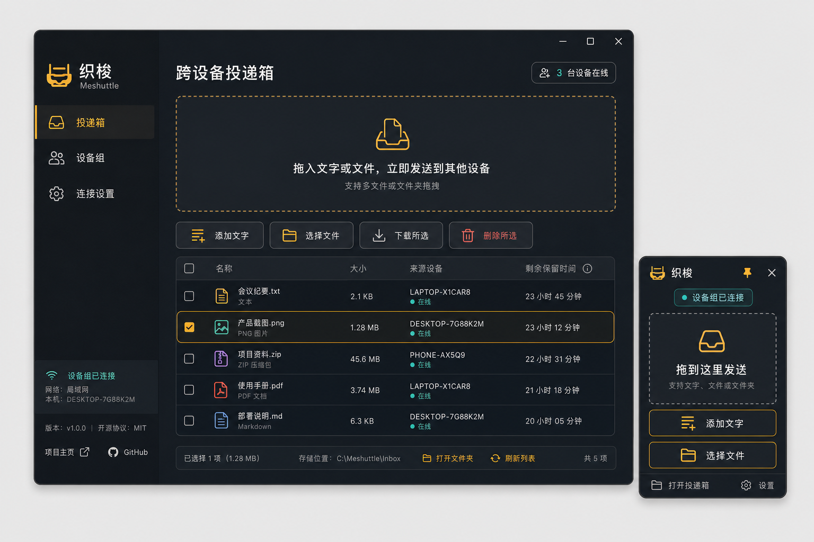
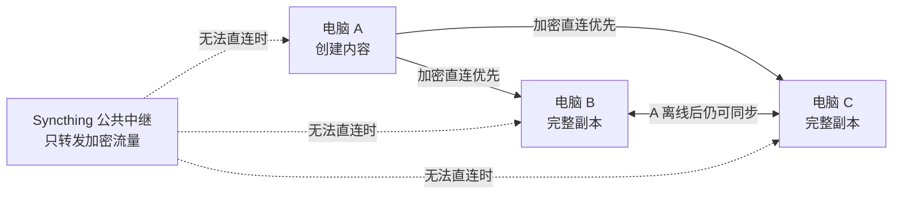
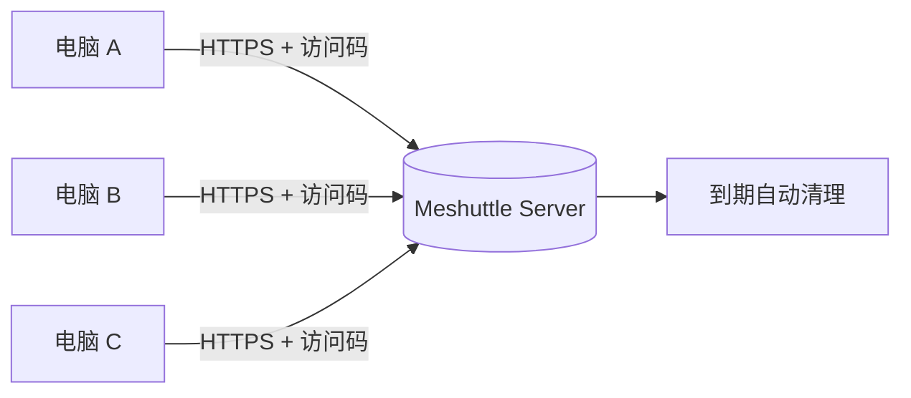
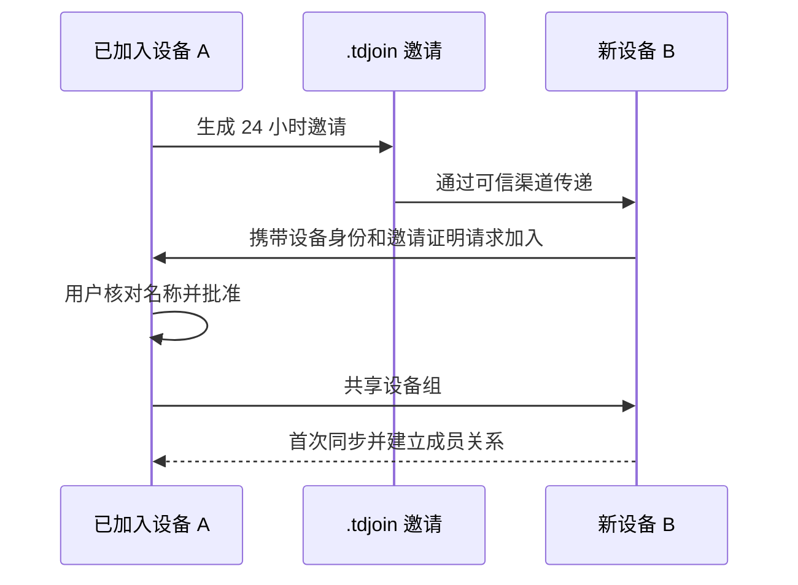

<p align="center">
  
</p>

<h1 align="center">织梭 Meshuttle</h1>

<p align="center">
  不依赖固定主机的跨设备私密投递箱
</p>

<p align="center">
  
  
  
  
</p>

织梭是一个开源的 Windows 跨设备临时投递工具。把文字或文件拖进悬浮窗，其他电脑就能看到、复制或下载。用户既可以连接自己的固定服务器，也可以让一台电脑在局域网中托管；没有服务器时，还可以建立跨网络的设备组。

“Meshuttle”由 **Mesh**（网状互联）和 **Shuttle**（织布梭）组合而成。数据像梭子一样在设备之间穿梭；设备组完成首次配对后，没有永久的“母机”，最初创建设备离线不会阻止其余在线设备继续同步。

> 当前版本：`1.0.0`　作者：**集御**　协议：自有代码采用 **MIT**，Syncthing 独立组件采用 **MPL-2.0**。

## 界面预览

<p align="center">
  
</p>

界面采用深色石墨背景与琥珀色强调色，包含：

- 完整投递箱：拖放、文字输入、内容列表、多选和批量操作。
- 置顶悬浮窗：不用切换窗口即可快速投递文字或文件。
- 设备组管理：查看在线状态、批准新设备、生成邀请和设置留存时间。
- 连接设置：远程服务器、本机托管和设备互联三种模式。

视觉稿由图像生成辅助设计，最终界面使用原生 HTML/CSS 实现，不会把截图作为程序界面。

## 目录

- [核心能力](#核心能力)
- [工作方式](#工作方式)
- [安装与首次启动](#安装与首次启动)
- [使用方法](#使用方法)
- [三种连接模式](#三种连接模式)
- [设备互联完整教程](#设备互联完整教程)
- [内容留存和删除](#内容留存和删除)
- [安全与隐私](#安全与隐私)
- [常见问题](#常见问题)
- [开发与构建](#开发与构建)
- [固定服务器部署](#固定服务器部署)
- [项目结构](#项目结构)
- [开源许可](#开源许可)

## 核心能力

| 能力 | 说明 |
| --- | --- |
| 文字投递 | 输入、粘贴或拖入纯文字，其他设备可以直接复制 |
| 文件投递 | 支持单文件、多文件选择和文件拖放 |
| 批量下载 | 勾选多个文件后，一次选择目录并批量保存 |
| 批量删除 | 可以选择文字和文件统一删除，删除前必须确认 |
| 置顶悬浮窗 | 小窗口始终置顶，提供拖放、添加文字和选择文件入口 |
| 三种连接方式 | 远程服务器、本机托管、设备互联 |
| 无固定主机 | 设备组完成配对后，初始设备下线不影响其余在线设备互传 |
| 新设备审批 | 邀请文件只是加入凭证，新设备仍需现有设备明确批准 |
| 自定义留存 | 用户可以设置内容保存的小时数或天数 |
| 自动清理 | 到期内容会从设备组或固定服务器中自动清理 |
| 离线补齐 | 已加入的设备再次上线后，会继续补齐缺少的内容 |
| 本地密钥保护 | 客户端秘密通过 Electron `safeStorage` 加密保存 |

## 工作方式

### 设备互联模式



设备互联由独立的 [Syncthing](https://syncthing.net/) 引擎提供设备发现、加密传输、NAT 穿透尝试和公共中继。织梭负责邀请、审批、内容格式、留存规则和操作界面。

### 固定服务器模式



固定服务器始终保存中心副本，适合需要持续在线、集中备份或多人从同一入口访问的情况。

## 安装与首次启动

### 普通用户

1. 打开项目的 [Releases](../../releases/latest) 页面。
2. 下载 `Meshuttle-Setup-1.0.0.exe`。
3. 核对发布页提供的 SHA-256。
4. 运行安装程序，选择安装目录并完成安装。
5. 首次启动后，从三种连接方式中选择一种。

当前安装包没有使用受信任的 Authenticode 代码签名证书，Windows 可能显示“未知发布者”。发布者应在正式大范围分发前配置可信代码签名；用户应先核对哈希和源码，再决定是否运行。

### 启动后的两个窗口

- **悬浮窗**：默认显示在屏幕右下角并保持置顶，用于日常快速投递。
- **完整投递箱**：点击悬浮窗顶部的“打开完整投递箱”按钮进入，适合查看、选择和管理内容。

关闭完整投递箱只会隐藏主窗口，悬浮窗仍会继续运行。点击悬浮窗右上角的“退出织梭”才会退出整个程序。

## 使用方法

### 发送文件

有三种方法：

1. 把一个或多个文件直接拖到主窗口的大型拖放区域。
2. 把文件拖到悬浮窗的“拖到这里发送”区域。
3. 点击“选择文件”，在系统文件选择器中选择一个或多个文件。

发送期间界面会显示当前文件名称和进度。完成后，文件会出现在“最近投递”列表中。

### 发送文字

在主窗口中：

1. 点击“添加文字”。
2. 输入或粘贴文字。
3. 点击“发送文字”，或者按 `Ctrl + Enter`。

在悬浮窗中：

1. 点击“添加文字”或者直接点击底部输入框。
2. 输入文字。
3. 按 `Enter` 或点击“发送”。

其他设备看到文字后，可以点击“复制文字”写入系统剪贴板。

### 下载一个文件

在内容列表中找到文件，点击该行右侧的“下载文件”，然后选择保存位置。

### 批量下载

1. 勾选需要下载的文件。
2. 点击“下载所选文件”。
3. 选择目标文件夹。
4. 织梭会依次下载全部选中文件；同名文件会自动增加编号，不会静默覆盖原文件。

文字内容可以参与批量选择和批量删除，但“下载所选文件”只处理文件。

### 删除内容

- 单项删除：点击内容右侧的“删除”。
- 批量删除：勾选多项内容，然后点击“删除所选”。

删除操作会显示确认框。设备互联模式下，删除会同步到组内其他设备；固定服务器模式下，内容会从服务器列表和数据目录移除。

## 三种连接模式

| 模式 | 适合场景 | 跨网络 | 固定中心 | 自动故障转移 |
| --- | --- | --- | --- | --- |
| 设备互联 | 没有服务器的个人多电脑使用 | 支持，依赖直连或公共中继 | 无 | 配对完成后支持 |
| 远程服务器 | 需要持续在线、集中存储 | 支持，需要 HTTPS 公网地址 | 有 | 由服务器运维方案决定 |
| 本机托管 | 同一可信局域网内临时使用 | 默认不支持 | 当前托管电脑 | 不支持 |

### 如何选择

- 三台电脑分布在家里、公司等不同网络，而且没有服务器：选择 **设备互联**。
- 已经拥有云服务器、NAS 公网入口或长期在线主机：选择 **远程服务器**。
- 所有电脑位于同一可信局域网：可以选择 **本机托管**。

## 设备互联完整教程

### 第一步：在第一台电脑创建设备组

1. 首次启动织梭。
2. 选择“设备互联”。
3. 选择“创建新设备组”。
4. 填写这台电脑的名称，例如“办公室电脑”。
5. 填写设备组名称，例如“我的设备”。
6. 设置默认保留天数。
7. 点击“创建设备组”。

创建完成后，这台电脑会拥有设备组的第一个完整副本。

### 第二步：生成邀请

1. 打开“连接设置”或主界面的“设备组”。
2. 点击“生成新设备邀请”。
3. 保存 `.tdjoin` 文件。
4. 通过可信渠道把文件传给另一台电脑。

邀请有效期为 24 小时。邀请文件包含限时加入秘密，不包含设备组内的文字或文件。

### 第三步：在新电脑导入邀请

1. 在新电脑安装并启动同一版本的织梭。
2. 选择“设备互联”。
3. 选择“加入已有设备组”。
4. 填写新电脑名称。
5. 点击“选择邀请文件”，导入 `.tdjoin`。
6. 点击“加入设备组”。

此时新电脑只会发送加入请求，还不能直接读取设备组内容。

### 第四步：在现有设备批准

1. 回到生成邀请的现有设备。
2. 打开“设备组”。
3. 在“等待你的批准”中核对设备名称。
4. 点击“允许加入”。
5. 在确认框中再次确认。

批准后开始首次同步。请等待新设备显示在线并完成数据复制，再关闭最初创建设备。

### 第五步：继续添加设备

任何已经加入并在线的设备都可以生成新的邀请。重复“生成邀请 → 导入邀请 → 人工批准”的流程即可。



## 远程服务器使用方法

1. 部署 `server/` 中的 Meshuttle Server。
2. 为公网入口配置 HTTPS。
3. 在客户端选择“远程服务器”。
4. 填写完整地址，例如 `https://meshuttle.example.com`。
5. 填写服务端的共享访问码。
6. 自签名 HTTPS 可以选择 PEM 证书；受信任证书无需导入。
7. 点击“验证并保存连接”。

客户端会先请求服务器并验证访问码。验证失败时不会保存错误配置。

## 本机托管使用方法

在作为主机的电脑上：

1. 选择“本机托管”。
2. 设置监听端口，默认 `8787`。
3. 设置内容保留天数。
4. 使用自动生成的共享访问码，或点击“重新生成访问码”。
5. 点击“启动本机服务器”。
6. 记录界面显示的局域网地址。

在其他电脑上：

1. 选择“远程服务器”。
2. 填写主机显示的局域网地址，例如 `http://192.168.1.10:8787`。
3. 填写相同的共享访问码。
4. 点击“验证并保存连接”。

首次使用时，Windows 可能询问防火墙权限。本机托管只应开放给可信的“专用网络”，不要直接把未加密 HTTP 端口暴露到公网。

## 内容留存和删除

- 固定服务器和本机托管按照服务器配置的保留时间清理。
- 设备互联按照设备组中最新的留存设置清理。
- 设备组修改留存时长后，会同步到其他成员，并对之后创建的新内容生效。
- 默认保留时间为 3 天。
- 清理通常由定时任务执行，刚刚到期的内容可能不会在同一秒消失。

自动清理只代表应用从当前数据目录删除内容，不保证底层磁盘快照、系统备份或恢复工具无法找回数据。

## 安全与隐私

### 已实现的保护

- Syncthing 设备连接使用 TLS 加密。
- 新设备需要限时邀请证明和人工批准。
- 设备名称与邀请证明绑定，不能直接复用其他设备的证明。
- 邀请内容带校验和、版本和过期时间。
- 客户端秘密使用 Electron `safeStorage` 保存。
- 固定服务器支持 HTTPS 和自签名 CA 导入。
- 删除、批量删除和批准设备都有明确确认步骤。

### 需要用户理解的边界

- 设备互联不是云盘，每台成员设备都保存完整数据副本。
- 公共中继只转发加密流量，不保存离线下载副本。
- 公共发现和中继可能看到 IP、设备 ID、连接时间和流量大小等元数据。
- 公共基础设施的可用性不由本项目保证。
- 设备磁盘上的内容是普通文件；建议启用 BitLocker 或其他磁盘加密。
- `.tdjoin` 文件应视为敏感的限时加入凭证。
- 当前版本不提供远程擦除已丢失设备的能力。设备丢失后，应新建设备组并重新邀请可信设备。
- 固定服务器使用共享访问码，不是多租户权限系统。

更多信息见 [SECURITY.md](SECURITY.md)。发现安全问题时，请使用代码托管平台的私密安全报告，不要公开粘贴邀请、访问码或服务器日志。

## 常见问题

### 新设备一直没有出现在“等待你的批准”中

检查以下项目：

1. 邀请是否已经超过 24 小时。
2. 生成邀请的设备和新设备是否都在线运行织梭。
3. 系统时间是否准确。
4. 防火墙或公司网络是否阻止 Syncthing 连接。
5. 等待公共发现完成；首次发现可能需要一些时间。

### 初始设备关闭后，另外两台不能立即同步

请先确认：

- 两台设备都完成了首次数据复制。
- 两台设备已经在成员列表中互相出现。
- 两台设备当前至少有一种可用连接：TCP、QUIC 或公共中继。
- 公共中继并不是永久在线存储；两台设备仍需同时在线才能互传新内容。

### 文件发送成功，但另一台电脑暂时没看到

- 点击“刷新列表”。
- 确认另一台设备显示在线。
- 大文件需要先完成同步；公共中继速度可能低于局域网直连。
- 如果设备刚刚加入，请先等待首次同步完成。

### 本机托管地址无法连接

- 确认两台电脑位于同一局域网。
- 使用界面显示的地址，不要在另一台电脑填写 `127.0.0.1`。
- 确认端口和访问码一致。
- 检查 Windows 防火墙是否允许专用网络访问。
- 部分访客 Wi-Fi 会隔离设备，导致局域网设备无法互访。

### 为什么安装包显示“未知发布者”

EXE 文件属性中的公司和作者是“集御”，但 Windows 的“已验证发布者”需要受信任的 Authenticode 代码签名证书。当前开源构建尚未配置该证书。

## 开发与构建

### 环境要求

- Windows 10/11 x64
- Node.js 22 或更新版本
- PowerShell

Syncthing 可执行文件不提交进 Git。构建脚本会下载固定版本并校验 SHA-256。

```powershell
# 克隆或下载仓库后，在项目根目录执行
cd meshuttle
npm --prefix client install
npm --prefix client run fetch:syncthing
```

开发运行：

```powershell
npm --prefix client start
```

运行全部客户端单元测试和 UI 契约测试：

```powershell
npm --prefix client test
```

运行固定服务器测试：

```powershell
npm --prefix server test
```

运行真实三节点故障转移测试：

```powershell
npm --prefix client run test:p2p
```

测试会启动三个隔离的 Syncthing 节点，验证：

- 邀请证明能够识别加入设备。
- 内容可以从初始节点复制到两个新节点。
- 两个新节点通过介绍机制互相认识。
- 初始节点停止后，剩余两个节点仍能继续同步。

生成 Windows NSIS 安装包：

```powershell
npm --prefix client run dist
```

输出位于 `client/release/`。

## 固定服务器部署

### Docker Compose

复制环境变量模板，并设置至少 24 位的随机访问码：

```bash
cp .env.example .env
docker compose up -d --build
```

Docker 默认在 `8787` 提供 HTTP 服务。公网部署必须在前面放置 Caddy、Nginx、Traefik 或云负载均衡，并终止 HTTPS。仓库提供 [Nginx 配置示例](deploy/nginx-meshuttle.conf)。

### 直接运行 Node.js 服务

```bash
cd server
ACCESS_TOKEN="replace-with-a-long-random-token" \
DATA_DIR="./data" \
PORT="8787" \
node src/server.js
```

主要环境变量：

| 变量 | 说明 | 默认值 |
| --- | --- | --- |
| `ACCESS_TOKEN` | 必填共享访问码，至少 24 字符 | 无 |
| `DATA_DIR` | 文件与元数据目录 | `server/data` |
| `RETENTION_MS` | 内容保留毫秒数 | `259200000`（3 天） |
| `MAX_FILE_BYTES` | 单文件大小上限 | 2 GB |
| `HOST` | 监听地址 | `0.0.0.0` |
| `PORT` | 监听端口 | `8443`；Docker 使用 `8787` |
| `TLS_CERT` | HTTPS 证书路径 | 无 |
| `TLS_KEY` | HTTPS 私钥路径 | 无 |

`TLS_CERT` 和 `TLS_KEY` 同时配置时，Node.js 服务会直接启用 HTTPS。

## 项目结构

```text
meshuttle/
├─ client/                 Electron Windows 客户端
│  ├─ build/               应用图标
│  ├─ p2p/                 Syncthing 控制、邀请和分布式存储
│  ├─ renderer/            主窗口、悬浮窗和设置界面
│  ├─ test/                存储、邀请和 UI 契约测试
│  └─ vendor/syncthing/    上游许可文件；EXE 由脚本下载
├─ server/                 固定服务器和接口测试
├─ deploy/                 systemd 与 Nginx 示例
├─ design-system/          UI 设计规范
├─ docs/design/            UI 视觉稿
├─ tools/                  构建图标、下载引擎和三节点验收脚本
├─ docker-compose.yml
├─ SECURITY.md
└─ THIRD_PARTY_NOTICES.md
```

## 自动化质量检查

客户端测试会检查：

- 所有静态按钮都包含可读文字或辅助标签。
- 每个按钮都有直接处理器、表单处理器或委托处理器。
- HTML 不存在重复 ID。
- JavaScript 引用的元素真实存在。
- 表单控件具有标签或可访问名称。
- 邀请防篡改、过期校验和设备证明正常。
- 并发写入不依赖容易冲突的共享索引文件。
- 到期项目目录可以自动清理。

这类测试能够减少已知回归，但不能证明软件永远不存在缺陷。欢迎通过 Issue 提交可复现的问题。

## 参与贡献

提交代码前请阅读 [CONTRIBUTING.md](CONTRIBUTING.md)，并运行：

```powershell
npm --prefix client test
npm --prefix server test
npm --prefix client run test:p2p
```

请勿提交真实服务器地址、访问码、邀请文件、证书私钥或真实用户数据。

## 开源许可

- 织梭自有代码： [MIT License](LICENSE)
- Syncthing 独立程序：Mozilla Public License 2.0
- Syncthing 版本、源码地址和归档哈希：[THIRD_PARTY_NOTICES.md](THIRD_PARTY_NOTICES.md)

---

<p align="center">
  <strong>织梭 Meshuttle</strong><br>
  让文字和文件在自己的设备之间自由穿梭。
</p>
